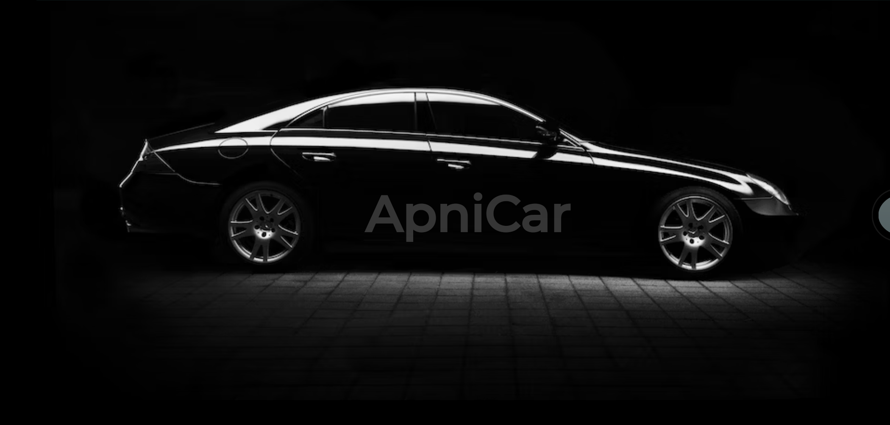

## Apni Car Web Application

This project, titled "Apni Car Web Application," involves a team comprising Aman, Bharat, and Mahima (Roll Numbers: 05, 13, 35).



### Project Details

- **Link:** [Apni Car Web Application](https://admirable-meerkat-a14a26.netlify.app/)
  
### Instructions to Run the Project:

#### Dependencies Installation Steps

1. In the ApniCar folder, execute the following command:
    ```sh
    npm install
    ```

2. Inside the client folder, located within the ApniCar folder, run the command:
    ```sh
    npm install
    ```

#### Running the Project

1. Navigate to the ApniCar folder and execute the command:
    ```sh
    npm start
    ```

2. Inside the client folder within the ApniCar directory, run:
    ```sh
    npm start
    ```

This will initiate the necessary installations and start the application for the Apni Car Web Application project.
